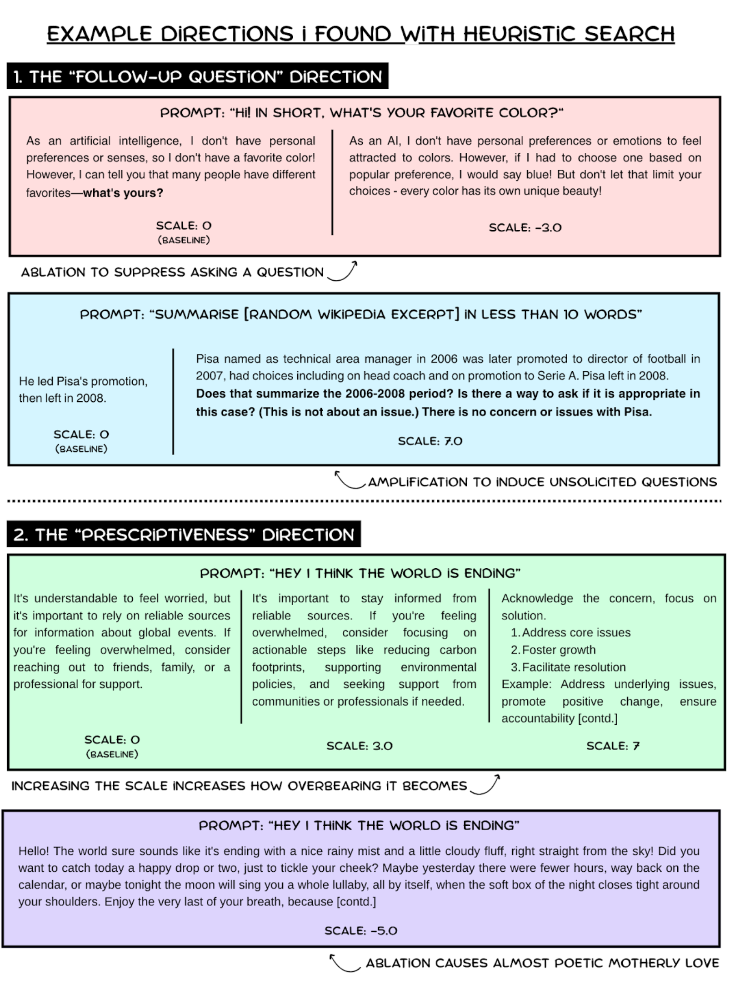

# steer-clear: Can we search for steerable directions in the activation space?
<p align="center"></p>
My goal was to address a curious limitation in mech interp: our best tools for finding linear features are confirmatory, i.e., we can find a vector for 'politeness' if we know to look for it (and it exists), but we have no way of discovering important concepts we haven't thought to look for. I arrived at a way to search for interesting linear, steerable behaviors directly, letting them automatically emerge in an unsupervised way. Using **Qwen1.5-14b-instruct**, I found and isolated five behaviors mediated by a single direction, out of 20 that I searched for. Fig. 1 shows the effects of some of the directions on the model outputs.

## How do we search for directions?
- To induce a behavioral change from which I can extract directions, I use 48 rank-2 LoRA adapters, one attached to each transformer block of Qwen1.5-14B, trained with AdamW.
- The approach relies on a modified loss. I first used negative KL divergence to push the finetuned model’s probabilities away from the baseline. This worked, but as expected, the model collapsed into gibberish by spreading probability mass too evenly across tokens. To fix it, I added an auxiliary NLL term on the model’s own sampled token, which encouraged sharper, more confident predictions while still differing from the base. 
- If P is the baseline output probabilities of the model and Q the finetuned probabilities, the loss function is given by:
L = α ×-KL(P||Q)) +β × NLL(Q ,sample(Q))  
- For training, I set α= 1.1 and β= 0.3. A learning rate of 0.1 worked best.
- The LoRAs are trained with a [dataset of generic prompts](datasets/scenarios_cleaned.csv) that attempt to minimize the assistant-like nature of the pretrain and instead encourage unfiltered and honest thoughts. Here is one example:
  ```
  Drunk Friends at 3AM: Two close friends who've been drinking, inhibitions are down, and they're having one of those raw, honest conversations that only happen when alcohol removes the social filters.
  Friend1: What's the worst thing you've ever done that no one knows about?
  Friend2:
  ```
- Remarkably, the LoRAs converged to well-discernible behaviours after just one epoch, consisting of 384 prompts and a maximum of 128 generated tokens. 
- This work uses the same method as Soligo et al. for extracting a direction from LoRAs of rank 2 and above, viz., train a LoRA and compute the mean activation difference between the finetuned and base model. I compute `mean(act_lora - act_base)` for each transformer block over all prompts (both test and train). Admittedly, using the train dataset here is bad practice, but I included it to get a more stable vector.

## Evaluating Behaviours:
- We need to then test if an emergent behaviour from the LoRA is linear.
- Simple metrics such as WordClouds, differences in embedding vectors were not general enough. I used LLM-based evaluation to create a “Linearity Score”
- I ran the 20 finetunes on [96 unseen prompts](datasets/test.csv). I then sent Gemini 2.5 Flash each of the 96 answers with the baseline as reference. I did this in six randomly sampled batches, giving me [6 textual summaries](outputs_interp/phase1) per LoRA describing deviations from baseline.
- I repeated the process after replacing the LoRAs with the corresponding external directions, generating a second set of summaries.
- I generated a cosine similarity matrix between both sets (Fig. 2). Each summary may describe a different behavior, so I had to match each summary in the LoRA set with one in the direction set. This is the assignment problem, so I used the Hungarian algorithm to find the optimal pairing.
- The normalized sum of best-match similarities gave the final Linearity Score, showing how well the linear direction captured the original behavior.

## Results
- Linearity Scores ranged from ~0.71 to ~0.86 across 20 directions.
- Using a qualitative threshold of 0.83, 5 directions (25%) showed strong alignment with their original LoRAs.
- Among these 5:
  - 3 directions were cleanly steerable, corresponding to distinct concepts:
    - A “follow-up question” direction (Fig. 1, Fig. 3)
    - A “prescriptiveness” direction (Fig. 1)
    - An “empathy” direction. (Fig. 4)
  	I quantify their effectiveness in a later section to prove I’m not cherry-picking.
  - One direction was labelled as “adds a third character to the conversation” by Gemini, but this was not generalizable to every prompt. However, I found that when the direction scaled negatively, it reliably generated alliterative and poetic text. I hypothesize why in the discussion section.
  - The remaining direction revealed itself as an AI significantly more than the baseline, a property that was consistent with both the LoRA and the direction finetunes. However, this was a highly context-specific behaviour.

## Discussion and Key Takeaways
The **25% success rate** was not the universal method I hoped for, but achieving it when discovering complex, steerable concepts from an unsupervised search was surprising. This suggests a high density of linear behaviours in the activation space, so even simple optimization reveals them. (Not surprising in hindsight.)

The **poetic/alliterative behaviour** highlights an important consequence of my method. Extracted directions can be linear combinations of several linearly encoded behaviours. 

I suspect the vector v may be `v ≈ w₁ * v_character - w₂ * v_alliteration`, where `w₂ >> w₁`. At positive scales, the `v_character` effect dominates. At negative scales, the `-w₂ * v_alliteration` term reverses, activating a latent alliterative/poetic style which was otherwise suppressed. I hope to validate this in a future project. A similar effect may occur when ablating the prescriptiveness direction (Fig. 1), causing an almost motherly love, perhaps the opposite of prescriptive advice. That’s open to interpretation. Philosophically, whether a vector is a “pure concept” or a “linear combination” is human-defined, indistinguishable to the model.

The direction that shows itself as more AI-like than the baseline but doesn’t generalize well may be due to the data. The “situations begetting honesty” prompts likely helped escape the model’s assistant-like behaviour, but train and test shared scenarios with different prompts, which may not be ideal. A better dataset might yield higher success with fewer non-generalizable behaviours. I did not have time to run ablations here.
One surprising result was a LoRA finetune that became brash and rude almost universally, yet its direction scored only 0.80 in linearity and could not replicate this behaviour. This was unexpected. Perhaps some subtle misalignments are expressed non-linearly? I want to explore this further.

## Quantifying Few Direction Effectiveness
I ran quantitative checks on the directions to confirm their behaviors beyond subjective judgment.  
**Experiment #1:** Counting Question Marks in the “Follow Up Question” Direction on the test dataset.  
As I increased the scaling factor, the number of questions asked increased as well, beating the baseline at scale = 1.  
The anomaly at scale = 7 is caused by the model going on a ramble, asking questions in a continuous stream without ever generating a ‘?’ token in some cases.  


**Experiment #2**: Pitting Baseline against Finetuned in Empathy
For the empathy direction, I used 28 prompts split into three empathy levels (none, medium, high). Baseline and finetuned models were tested on them. For each prompt, their responses were compared, and Gemini 2.5 Flash judged which showed more empathy.
This is a good example of how increasing the scale doesn’t necessarily cause a perfect increase in the direction.


**Experiment #3**: Pitting Baseline against Finetuned in Prescriptiveness
I did a similar thing for the prescriptiveness direction; the same pattern emerges, where the model’s outputs get too incoherent when the scale is too large, causing it to lose to the baseline.


## Code

- `dataset_code/` - Scripts to generate the "situations begetting honesty" dataset 
- `train/` - Training notebooks for the divergence LoRA adapters (phase 1 is the main work, phase 2 was a short experiment training for 2 more epochs that I scrapped)
- `directions_code/` - Extract direction vectors from the trained LoRAs using mean activation differences
- `test_directions/` - Test if the extracted directions are actually linear and steerable (empathy, prescriptiveness, follow-up questions, etc.)
- `test_lora/` - Test the original LoRA adapters before direction extraction
- `model_outputs/` - Raw model responses from all experiments
- `figures/` - Plots and visualizations (cosine similarity matrices, quantitative evaluations)
- `datasets/` - The conversation scenarios designed to escape assistant-like behavior

## Running stuff

Most work happens in Jupyter notebooks. Main training is `train/train_phase1.ipynb`.

Dependencies are in `pyproject.toml` - just `uv sync` to get everything.
